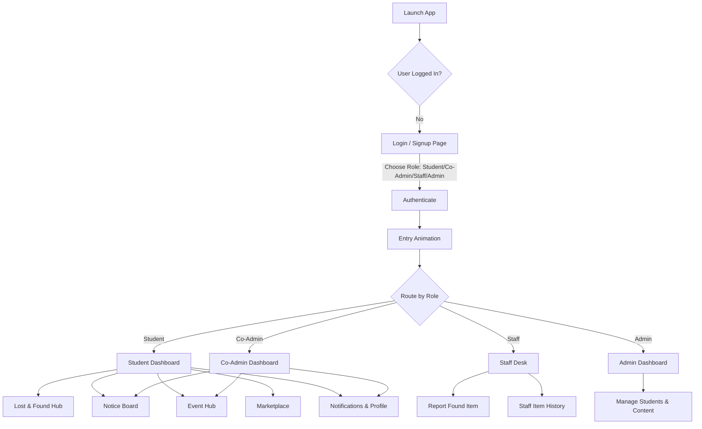

# Product Requirements Document (PRD)

## Project Name: Campus Connect Web Application
**Document Version:** 1.0.0  
**Target Environment:** Web (Mobile, Tablet, Desktop Responsive)  
**Author:** Campus Connect Engineering Team  
**Status:** Approved & Active Implementation  

---

## 1. Executive Summary & Vision

Colleges and universities host vibrant ecosystems of academic departments, student clubs, sports events, administrative offices, and peer exchanges. However, communication on campus is frequently fragmented across disorganized WhatsApp groups, physical bulletin boards, isolated email circulars, and unofficial social media pages.

**Campus Connect** is a unified, all-in-one campus engagement and collaboration platform engineered specifically for collegiate environments. It provides a centralized digital space where students, student leaders (Co-Admins), campus staff, and college administrators interact in real-time. By integrating **Lost & Found tracking**, **Official Notice Distribution**, **Club & Event Management**, and an **Internal Student Marketplace**, Campus Connect eliminates operational silos, fosters campus transparency, and drives active student participation.

---

## 2. Target User Personas & Roles

| Persona / Role | Description | Primary Needs & Pain Points |
| :--- | :--- | :--- |
| **Student** | Undergraduate & Postgraduate students across all engineering and academic departments. | - Quick access to urgent notices, exam timetables, and holiday announcements.<br>- Easy way to report/recover misplaced items (calculators, wallets, ID cards).<br>- Finding and registering for campus hackathons and club activities.<br>- Buying and selling secondhand academic goods (textbooks, drawing kits, cycles) safely on campus. |
| **Co-Admin (Club Lead / Dept Rep)** | Student council members, technical club leads (Coding Club, Robotics, IEEE), and event heads. | - Publishing club-specific announcements and departmental notices.<br>- Creating and scheduling campus events with RSVP/registration tracking.<br>- Reaching targeted batches without reliance on faculty intermediaries. |
| **Campus Staff / Security** | Non-teaching campus staff, peons, department lab assistants, and main gate security personnel. | - Logging items found in classrooms, corridors, and grounds into an official registry.<br>- Directing students to the security desk for verified item handovers.<br>- Managing campus maintenance requests (upcoming feature). |
| **Administrator (Principal / Dean / Faculty)** | Institutional leadership and system managers. | - Platform-wide oversight of active students, co-admins, and listings.<br>- Moderation authority to manage student directories, notices, and listings.<br>- High-level analytics on campus engagement metrics. |

---

## 3. Key Problem Statements & Solutions

```
+-------------------------------------------------------------+
¦                      CORE PROBLEMS                         ¦
+-------------------------------------------------------------¦
¦ ? Fragmented Notices        ¦ ? Lost Belongings Chaos     ¦
¦ Important circulars buried   ¦ Calculators, IDs, & keys lost¦
¦ across multiple chat groups  ¦ with no central registry     ¦
+------------------------------+------------------------------¦
¦ ? Low Club Visibility       ¦ ? Inefficient Campus Trade  ¦
¦ Events lack centralized RSVP ¦ No safe, zero-cost student   ¦
¦ & discovery platform         ¦ marketplace for academic gear¦
+-------------------------------------------------------------+
                               ¦
                               ?
+-------------------------------------------------------------+
¦                 CAMPUS CONNECT SOLUTIONS                    ¦
+-------------------------------------------------------------¦
¦ ? Digital Notice Board      ¦ ? Unified Lost & Found Desk ¦
¦ Instant broadcast, category  ¦ Real-time reporting, photos, ¦
¦ filters, PDF downloads       ¦ staff security desk tracking ¦
+------------------------------+------------------------------¦
¦ ? Interactive Event Hub     ¦ ? Peer Campus Marketplace   ¦
¦ Club directory, 1-click RSVP,¦ Safe in-campus listings,     ¦
¦ direct registration status   ¦ condition badges & direct chat¦
+-------------------------------------------------------------+
```

---

## 4. Detailed Module Requirements

### 4.1. Multi-Role Authentication & Access Control
- **Role Selection:** Support 4 distinct roles: Student, Co-Admin, Staff, and Administrator.
- **Login Options:**
  - Standard email/username login for Students, Co-Admins, and Administrators.
  - Dedicated Mobile Number login for campus support staff and peons.
- **Role-Tailored Registration:**
  - **Student:** Name, College Email, Branch (CSE, ECE, Mechanical, IT, etc.), Year of Study (1st to 4th Year), Username, and Password.
  - **Co-Admin:** Name, College Email, Club/Department affiliation (Coding Club, Robotics, Cultural, NSS, etc.), Username, and Password.
  - **Staff:** Full Name, Mobile Number, Position/Title (e.g., Peon, Lab Assistant, Security Desk), Department (Optional), Username, and Password.
- **Session Simulation:** Immediate transition into the role-specific dashboard with dynamic navigation and authorization scoping.

---

### 4.2. Central Student Dashboard
- **Dynamic Hero Banner:** Branded institutional masthead (`MHSSCE Campus Network`) with high-res campus visual integration.
- **Quick-Access Modular Grid:**
  - Lost & Found Card with live active report counts.
  - Notice Board Card with total published notice counts.
  - Event Hub Card with upcoming event counters.
  - Marketplace Card with active product counts.
- **Live Campus Feed:** Dynamic feed aggregating the latest notice, upcoming event RSVP, recent lost item report, and new marketplace listing.

---

### 4.3. Lost & Found Management Hub
- **Dual-Mode Interface:**
  - **Browse Mode:** Visual cards displaying item image, color coding, category chip, location, date found, item description, and reporter badge.
  - **Report Mode:** Interactive submission form with photo upload, item name, category selection (`Electronics`, `Accessories`, `Books`, `Stationery`, `Personal Items`, `Other`), date picker, location specification, and detailed description.
- **Advanced Filtering & Search:**
  - Real-time text search querying item title, description, and location simultaneously.
  - Category dropdown filter and sorting (Newest first vs. Oldest first).
- **Direct Contact Integration:** One-click contact modal to connect with the student or staff member holding the item.

---

### 4.4. Digital Notice Board
- **Categorized Feed:** Filter notices by category (`Examination`, `Academic`, `General`, `Guidelines`, `Events`).
- **Urgent Announcement Flags:** High-contrast `Important` badges and red accent borders for critical circulars (e.g., Mid-Sem exam schedules, Anti-Ragging guidelines).
- **Document Attachments:** Embedded indicators with one-click download access for official PDF circulars and document attachments.
- **Co-Admin Publishing Workflow:** Authorized Co-Admins can create, tag, and publish college notices with document attachment options.

---

### 4.5. Club & Event Hub
- **Club Directory:** Showcase student organizations with customized club color tokens, member count, leadership info, and mission statement.
- **Event Lifecycle & Discovery:**
  - Event card featuring banner imagery, date/time, venue, host club, and registration status (`Open` vs. `Closed`).
  - **One-Click RSVP:** Instant registration state management with visual feedback (`Registered` with checkmark icon).
- **Co-Admin Event Control:**
  - Event creation modal with image uploader, date/time pickers, venue inputs, and detailed agenda.
  - Edit and delete actions with confirmation dialogs.

---

### 4.6. Peer-to-Peer Campus Marketplace
- **Direct Campus Trade:** Buy and sell secondhand textbooks, calculators, engineering drawing kits, lab coats, and campus cycles.
- **Item Cards & Details:** Highlighting asking price (?), condition chip (`Like New`, `Good`, `Fair`, `Used`), seller name, pickup location, and product photos.
- **Sorting & Search:**
  - Price sorting: *Low to High* and *High to Low*.
  - Category and keyword searching.
- **In-App Seller Modal:** Safe contact card showing seller identity, pickup landmark, and direct message trigger.

---

### 4.7. Staff Operations Desk
- **Staff Found Item Submission:** Streamlined form tailored for campus staff with predefined holding locations (`Main Gate Security Desk`, `Staff Room`, `Central Library Counter`, `Admin Office`).
- **Reported History Log:** Dedicated list of all items logged by staff, with status tracking (`At Security Desk`, `Claimed by Student`).
- **Future Staff Capabilities Preview:** Interactive preview cards showcasing upcoming staff modules (Maintenance Helpdesk, Exam Duty Rosters, Hall Reservation).

---

### 4.8. System Administrator Control Center
- **System Overview Metrics:** Total students, active co-admins, published notices, upcoming events, lost item reports, and active marketplace listings.
- **User Management Table:** Paginated student directory with name, department branch, academic year, email, and deletion controls.
- **Platform Management Shortcuts:** Quick links to manage co-admins, notices, events, listings, and system settings.

---

### 4.9. User Profile & Notification Center
- **Profile Center:** User identity banner, avatar generation, role chips, department tags, contact details, and personal activity counters (Items listed, reports submitted, events joined).
- **Notification Inbox:** Categorized notification cards (Notices, Events, Lost & Found, Marketplace inquiries) with unread status indicators and "Mark all as read" capability.

---

## 5. Non-Functional Requirements (NFRs)

### 5.1. Performance & Responsiveness
- **Fast First Paint:** < 1.0s time-to-interactive on standard broadband and 4G mobile networks.
- **Fluid Layouts:** 100% responsive design across all viewports (Mobile 360px+, Tablet 768px+, Desktop 1024px, Ultra-wide 1440px+).
- **Zero Layout Shifts:** Consistent image aspect ratios, skeleton loaders, and optimized CSS transforms.

### 5.2. UI/UX & Accessibility
- **Theme Support:** Native Dark and Light themes with fluid CSS variable tokenization.
- **Typography:** Premium Google Fonts (`Plus Jakarta Sans` and `Inter`) for maximum legibility.
- **Color Contrast:** High contrast WCAG AA compliant ratios for text and actionable icons.
- **Interactive Feedback:** Micro-animations, button hover states, modal backdrop blur, and entering screen animations.

### 5.3. Security & Data Integrity
- **Role Scoping:** Strict UI route and state fencing ensuring only authorized roles access administrative actions.
- **Input Sanitization:** Required field validations and form boundary enforcement.

---

## 6. User Journey & Navigation Flow



---

## 7. Future Feature Roadmap

1. **Phase 2 - Backend Integration & Live Database:**
   - PostgreSQL / MongoDB database with Prisma ORM.
   - Node.js / Express RESTful API with JWT Authentication and bcrypt password hashing.
   - AWS S3 or Cloudinary storage for high-resolution item & receipt image uploads.
2. **Phase 3 - Real-Time Push Notifications & Live Chat:**
   - WebSockets (Socket.io) for direct buyer-seller marketplace chat.
   - Web Push notifications for urgent examination notices and matched lost & found items.
3. **Phase 4 - Campus Operations Expansion:**
   - Campus Maintenance Helpdesk with photo-based ticketing.
   - Seminar Hall and Audio-Visual Lab automated reservation calendar.
